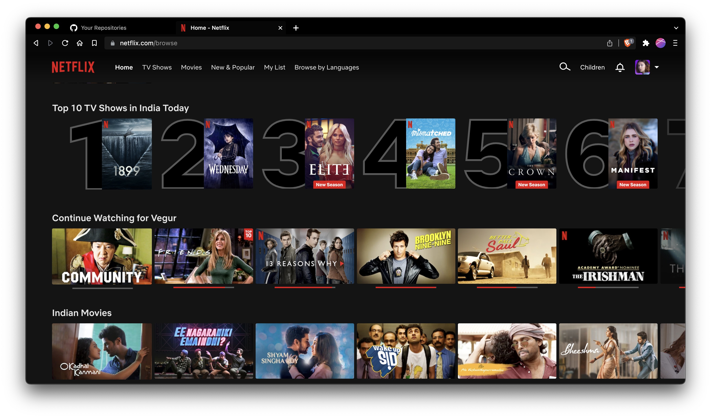

# Movie recommendation system

They are information filtering systems , where they improve quality of search results and provides items that are more related to the search or based on the previous history of the user. They are determined based on `rating` and `preferences` that a user would give to them. Even Amazon, youtube and facebook uses these recommendation systems to provide good results for the end users.

Over the top (OTT) platforms like [Netflix](https://www.netflix.com/) and [Prime Video](https://www.primevideo.com/) use movie recommendation systems as their base strategy for success. In this project lets try to build a simple movie recommendation system.

There are three types of movie recommendation systems.

**📌** **_Demographic filtering_**

> Here we offer generalized recommendation to every user just based on popularity and ratings of the movie and genre. This method simply assumes that a movie is most likely interested by user if average users got interested in that one.

**📌** **_Content based filtering_**

> In this system we filter based on the content of the movie. That is movies with similar plot line or we can also suggest based on similar genre, director and important crew of that movie. Here also we are assuming that user will watch movies similar to what he searched for, so it is not personalized based recommender system.

**📌** **_Collaborative filtering_**

> Here when metadata is not available, we match users with similar interests to one other and recommend systems. That is, since content based filtering, is just recommending similar movies but going across various genres and based on the users taste so here we map users with similar tastes and recommend movies based on that. Here we are personalizing the movie interests.

In this project we use tmdb 5000 movies and credits data set for training and evaluation.

---

## Datasets and their details

**📘** **tmdb_5000_credits.csv**

> - `movie_id` - A unique identifier for each movie.
> - `title` - Title of the movie
> - `cast` - The name of lead and supporting actors.
> - `crew` - The name of Director, Editor, Composer, Writer etc.

**📘** **tmdb_5000_movies.csv**

> - budget - The budget in which the movie was made.
> - `genre` - The genre of the movie, Action, Comedy ,Thriller etc.
> - homepage - A link to the homepage of the movie.
> - `id` - This is in fact the movie_id as in the first dataset.
> - keywords - The keywords or tags related to the movie.
> - original_language - The language in which the movie was made.
> - original_title - The title of the movie before translation or adaptation.
> - overview - A brief description of the movie.
> - `popularity` - A numeric quantity specifying the movie popularity.
> - production_companies - The production house of the movie.
> - production_countries - The country in which it was produced.
> - release_date - The date on which it was released.
> - revenue - The worldwide revenue generated by the movie.
> - runtime - The running time of the movie in minutes.
> - status - "Released" or "Rumored".
> - tagline - Movie's tagline.
> - `title` - Title of the movie.
> - `vote_average` - average ratings the movie received.
> - `vote_count` - the count of votes received.

---

## Structure

- Tmdb datasets used for this project are available in Data folder.
- And movie recommendation system python codes are available in Code folder.

---

## References

- Kaggle Notebook by Ibtesam Ahmed, [Getting started with a Movie Recommendation System](https://www.kaggle.com/code/ibtesama/getting-started-with-a-movie-recommendation-system/notebook).
- Some other internet resources.
